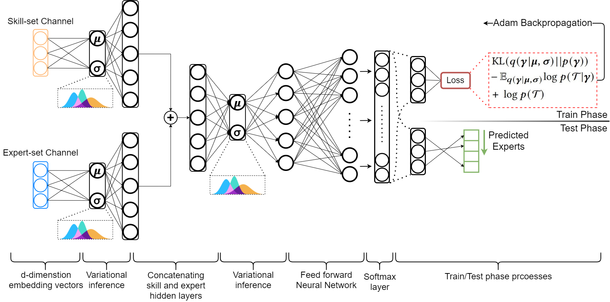
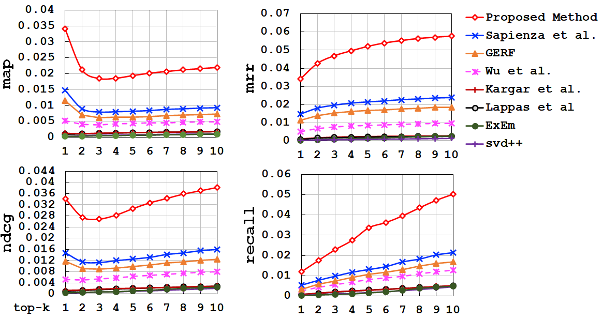
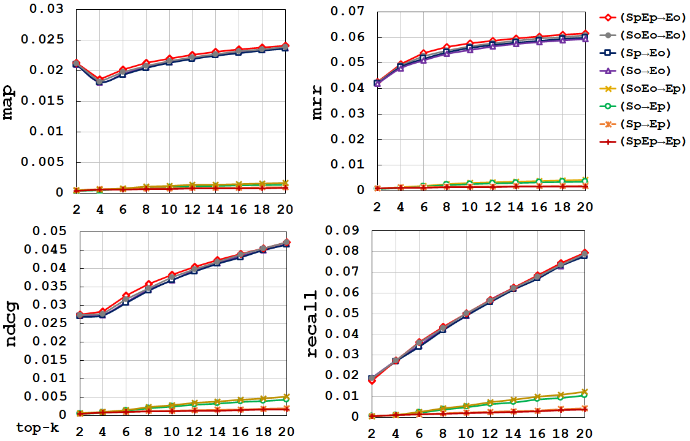
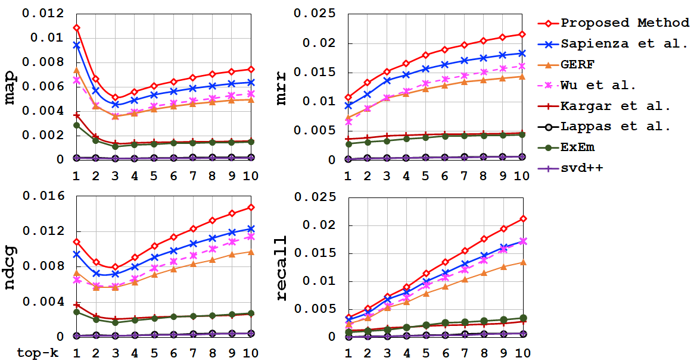
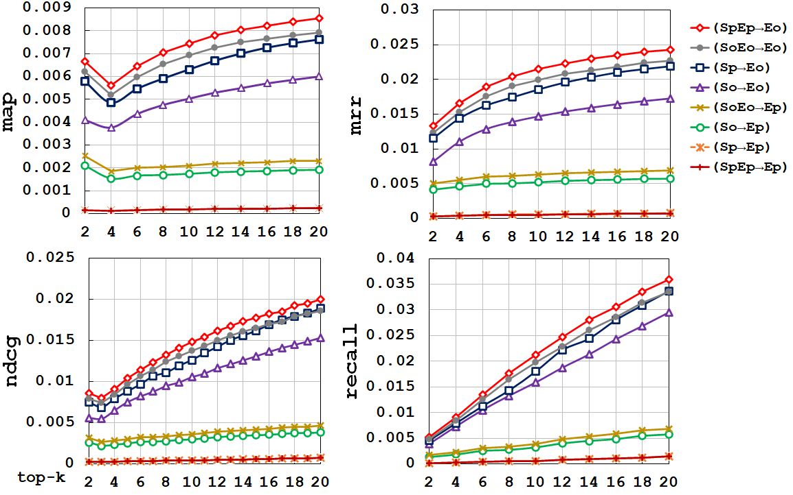
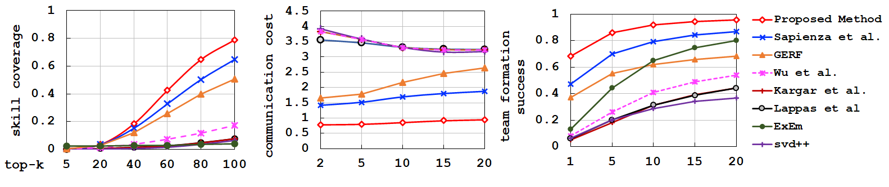
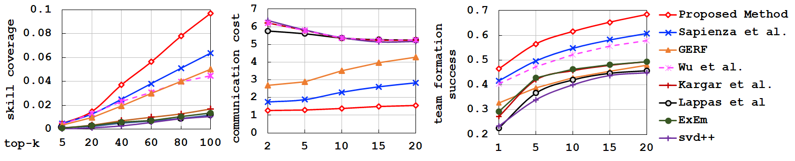
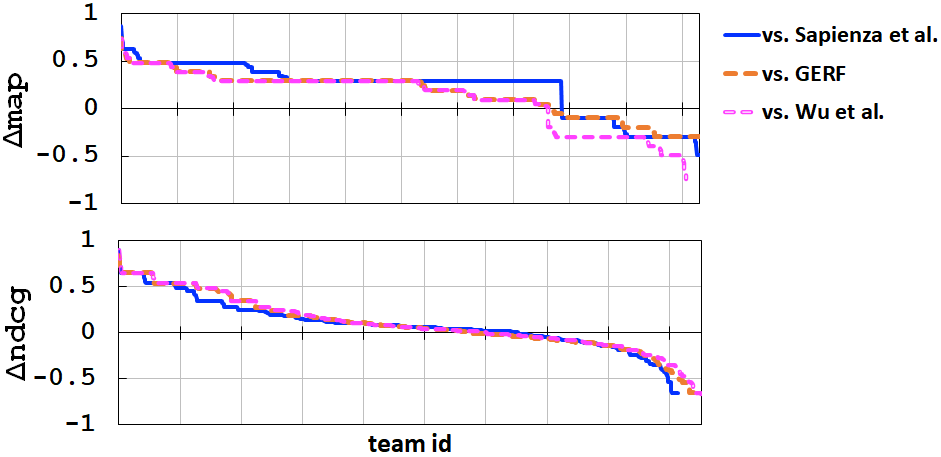
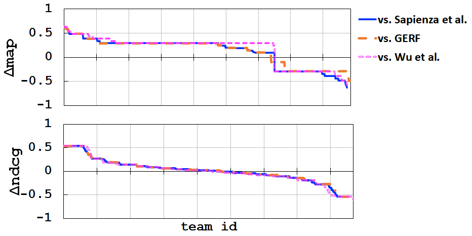

# A Variational Neural Architecture for Skill based Team Formation

[](https://www.python.org/) [](http://ansicolortags.readthedocs.io/?badge=latest)

Team formation is concerned with the identification of a group of experts who have a high likelihood of effectively collaborating with each other in order to satisfy a collection of input skills. Solutions to this task have mainly adopted graph operations and at least have the following limitations: (1) they are computationally demanding as they require finding shortest paths on large collaboration networks; (2) they use various types of heuristics to reduce the exploration space over the collaboration network in order to become practically feasible; therefore, their results are not necessarily optimal; and, (3) they are not well-suited for collaboration network structures given the sparsity of these networks.

Our work proposes a variational Bayesian neural network architecture that learns representations for teams whose members have collaborated with each other in the past. The learnt representations allow our proposed approach to mine teams that have a past collaborative history and collectively cover the requested desirable set of skills. Through our experiments, we demonstrate that our approach shows stronger performance compared to a range of strong team formation techniques from both quantitative and qualitative perspectives.


<p align="center"><em>Model Architecture.</em></p>

## Installation

You need to install the following libraries using pip or conda command before running the codes:

```
Python 3+
Tensorflow V1.X
Keras
Stellargraph 
Joblib
Gensim
Tqdm
```

## Dataset

### DBLP
Dataset used in this pepr can be found in [Aminer website](https://lfs.aminer.cn/lab-datasets/citation/dblp.v8.tgz). You need to download the dataset before running the codes. After downloading the dataset,extract it into the [dataset directory](/dataset). However, the preprocessed dataset is already exist in dataset folder and codes can use them without any furthur steps. The authors of each paper are considered to represent a team, and the specializations required for the paper are its skill sets. For extracting skills from the raw data, after stop word removal and stemming, we identify the top-2,000 unigram, bigram and trigrams of the phrases with the highest tf-idf scores from the paper titles to represent the set of skills. We construct the heterogeneous collaboration network from the DBLP dataset by considering the authors, papers, skills, and venues as the nodes of the network. The edges of the collaboration network represent associations between author-paper, paper-skill and paper-venue node pairs.

### IMDB
For the IMDB dataset, we considered each actor to represent an expert and the actors of each movie to form a team. We formed the skill set of each movie using their attributes including directors, genres, language, country of origin, movie length and content rating. Our skill set contains 21 unique genres and 2,399 different directors.

## Running the Model

After preparing the input data, models can be run individualy. You can then simply run the **"model.py"** in [model](/model) folder by using this command in terminal:
	
     `python <model_name.py>`

	* Take note that parameters are initilized at the beggining of the code and can be changed for experiments.
  
After running each model, a series of question may appear on the screen asking for the embeddings, loading pre-trained weights on the screen. After the training phase, model will be tested on each fold automatically and predicted outputs will be saved in output directory.


## Evaluating the results

Predictions can be evaluated using the codes provided in eval folder. All the reported numbers/charts can be reproduced by running the **"comparison.py"** python file in [eval](/eval) directory.
For each of the methods, an individual csv file will be generated respectively. You can modify list of evaluating methods in the **"comparison.py"** file under the "file_names" variable. Please take note that for each of the methods, their prediction output file must be avaialble in the [predictions](/output/predictions) folder under the output directory. Comparison file will generate following IR-related metrics for the desired **k**:

1. Coverage @k
2. NDCG @k
3. MAP @k
4. MRR @k

Here are plots for the calculated metrics:

<p align="center"> </p>
<p align="center"><em>Proposed method and its vatiations IR metrics performance on DBLP dataset.</em></p>
<p align="center"> </p>
<p align="center"><em>Proposed method and its vatiations IR metrics performance on IMDB dataset.</em></p>

Also, three qualitative metrics scores that reported in the paper also will be generated by running the **"comparison.py"** file. The output numbers can then be used for the visualization. Metrics are:

1. Skill Coverage @k
2. Communication Cost @k
3. Team Formation Success @k

<p align="center"></p>
<p align="center"><em>Proposed method qualitative metrics performance on DBLP dataset.</em></p>
<p align="center"></p>
<p align="center"><em>Proposed method qualitative metrics performance on IMDB dataset.</em></p>

Numbers required for the Help-Hurt diagram are generated using by **"HelpHurt.py"** file in [eval](/eval) directory. After running the file, a csv file will be available in ["eval_results"](/output/eval_results) folder under output directoy.
You can then use the results in csv file to plot the diagram. For example:

<p align="center"></p>
<p align="center"><em>HelpHurt diagram for DBLP dataset.</em></p>
<p align="center"></p>
<p align="center"><em>HelpHurt diagram for IMDB dataset.</em></p>


## Contributing
This github is provided as a complementary materials for a IP&M journal paper.

